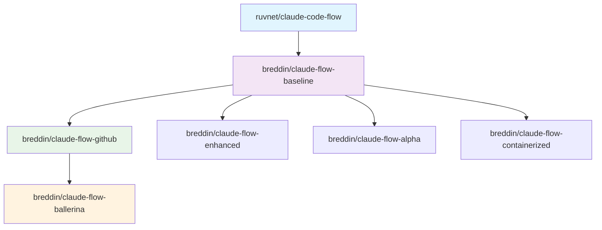

# Claude Flow Repository Architecture

## Overview

The Claude Flow ecosystem follows a structured multi-repository approach with clear upstream and downstream relationships. This architecture enables controlled feature propagation while maintaining specialized customizations for different use cases.

## Repository Flow Hierarchy



## Repository Definitions

### 1. **ruvnet/claude-code-flow** (Master/Upstream)
- **Role**: Primary upstream repository
- **Purpose**: Core Claude Flow functionality and features
- **Maintainer**: ruvnet
- **Update Frequency**: As needed by upstream maintainer
- **Sync Direction**: Source → Downstream

### 2. **breddin/claude-flow-baseline** (Mirror/Baseline)
- **Role**: Clean mirror of upstream for breddin ecosystem
- **Purpose**: Maintains a stable baseline for all breddin derivatives
- **Customizations**: None (pure mirror)
- **Update Frequency**: Weekly automated sync from upstream
- **Sync Direction**: ruvnet/claude-code-flow → breddin/claude-flow-baseline

### 3. **breddin/claude-flow-github** (GitHub Integration)
- **Role**: GitHub-optimized variant with container enhancements
- **Purpose**: Adds GitHub-specific features and container startup processing
- **Key Features**:
  - Custom startup processing for containers
  - GitHub Codespaces optimization
  - Cross-repository permissions management
  - Enhanced GitHub CLI safety wrappers
- **Base**: breddin/claude-flow-baseline
- **Update Frequency**: Bi-weekly merge from baseline + feature development

### 4. **breddin/claude-flow-ballerina** (Language Extension)
- **Role**: Ballerina programming language implementation
- **Purpose**: Adds Ballerina language support for enterprise integration
- **Key Features**:
  - All GitHub permissions from claude-flow-github
  - Ballerina language runtime integration
  - Enterprise integration patterns
  - Ballerina-specific development tools
- **Base**: breddin/claude-flow-github
- **Update Frequency**: Monthly merge from github variant + language features

## Additional Specialized Repositories

### Supporting Repositories
- **breddin/claude-flow-enhanced**: Extended feature set
- **breddin/claude-flow-alpha**: Experimental features
- **breddin/claude-flow-containerized**: Container-first approach
- **breddin/claude-flow-ui**: User interface components
- **breddin/claude-flow-service**: Service architecture

## Change Flow Management

### 1. Upstream Integration Process

```bash
# Weekly sync from upstream to baseline
ruvnet/claude-code-flow → breddin/claude-flow-baseline

# Bi-weekly merge to specialized repositories
breddin/claude-flow-baseline → breddin/claude-flow-github
breddin/claude-flow-github → breddin/claude-flow-ballerina
```

### 2. Feature Development Process

```bash
# For GitHub-specific features
breddin/claude-flow-github (feature branch) → PR → merge

# For Ballerina-specific features  
breddin/claude-flow-ballerina (feature branch) → PR → merge

# For baseline changes
breddin/claude-flow-baseline → PR to ruvnet/claude-code-flow
```

## Branching Strategy

### Main Branch Structure
- **main**: Stable, production-ready code
- **develop**: Integration branch for features
- **upstream-sync**: Dedicated branch for upstream merges

### Feature Branch Naming
- `feature/github-*`: GitHub-specific features
- `feature/ballerina-*`: Ballerina-specific features
- `feature/container-*`: Container-related features
- `upstream/sync-*`: Upstream synchronization branches

## Automated Workflows

### Sync Automation
1. **Weekly Upstream Sync** (baseline repository)
2. **Bi-weekly Downstream Merge** (github repository)
3. **Monthly Language Update** (ballerina repository)

### CI/CD Integration
- Each repository maintains its own CI/CD pipeline
- Shared workflows for common tasks
- Environment-specific deployments

## Conflict Resolution Strategy

### Merge Conflict Handling
1. **Automated Resolution**: Simple conflicts via scripts
2. **Manual Review**: Complex conflicts require human intervention
3. **Feature Preservation**: Maintain repository-specific customizations
4. **Documentation**: Log all conflict resolutions

### Version Management
- Semantic versioning across all repositories
- Tag synchronization for major releases
- Feature flag management for experimental features

## Development Guidelines

### Contributing to Specialized Features
1. Create feature branches in the appropriate repository
2. Ensure compatibility with upstream changes
3. Document repository-specific customizations
4. Test integration with dependent repositories

### Maintaining Upstream Compatibility
1. Regular sync testing
2. Automated compatibility checks
3. Feature isolation strategies
4. Rollback procedures

## Monitoring and Maintenance

### Health Checks
- Repository sync status monitoring
- Build status across all variants
- Dependency update tracking
- Security vulnerability scanning

### Documentation Maintenance
- Architecture documentation updates
- Feature matrix maintenance
- Migration guides for major changes
- Troubleshooting guides

## Contact and Support

- **Upstream Issues**: ruvnet/claude-code-flow repository
- **Baseline Issues**: breddin/claude-flow-baseline repository
- **GitHub Features**: breddin/claude-flow-github repository
- **Ballerina Features**: breddin/claude-flow-ballerina repository

---

*Last Updated: August 22, 2025*
*Version: 1.0.0*
